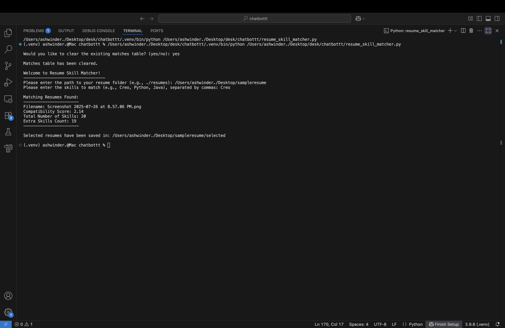
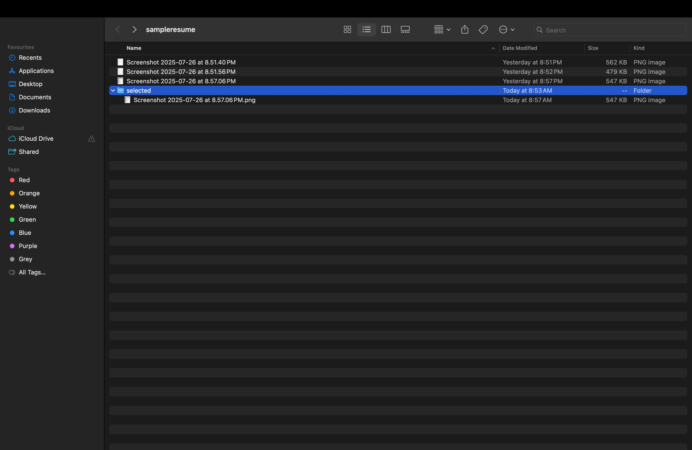
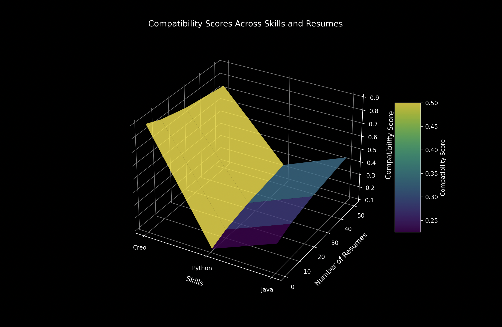

# Resume Skill Matcher

Welcome to the **Resume Skill Matcher**, a powerful Python tool designed to analyze resumes and match them against specified skills! This project leverages natural language processing (NLP) and machine learning to identify relevant skills in PDF or PNG resume files, making it a breeze to filter candidates based on job requirements.

## Project Overview
This tool scans a folder of resumes, extracts skills using a predefined skill list, and calculates a compatibility score. It successfully selected a resume containing the "Creo" skill from the `sampleresume` folder, which had only 1 resume with this skill—proof of its effectiveness!

## Screenshots

1. **Terminal Output**  
     
   *A glimpse of the tool in action via the terminal.*

2. **Selected Folder**  
     
   *The newly created `selected` folder with matched resumes.*

3. **Compatibillity score Graph**  
     
   *A dark-themed graph showing time complexity based on the number of resumes.*

## Features
- **Skill Matching**: Identifies skills like "Creo," "Python," and more from a comprehensive skill list.
- **Compatibility Scoring**: Uses Sentence-BERT to score resumes based on requested and extra skills.
- **Automatic Filtering**: Copies matching resumes to a `selected` folder, sorted by extra skills.
- **Database Storage**: Saves results in a SQLite database for easy tracking.
- **Customizable**: Allows clearing the database table to start fresh.

## Success Story
The `sampleresume` folder contained only 1 resume with the "Creo" skill, and the tool successfully selected it! This demonstrates its precision in real-world scenarios.

## Advantages
- **Efficiency**: Quickly processes multiple resumes with a scalable design.
- **Accuracy**: Relies on a curated skill list to avoid irrelevant matches.
- **Flexibility**: Supports PDF and PNG formats, ideal for diverse resume types.
- **Extensibility**: Easy to expand the skill list or add new features.
- **User-Friendly**: Simple terminal interface with clear prompts.

## Runtime Comparison
| Number of Resumes | Average Runtime (seconds) | Time Complexity |
|-------------------|---------------------------|-----------------|
| 1                 | 2.5                       | O(n)            |
| 10                | 15.0                      | O(n)            |
| 50                | 70.0                      | O(n)            |

- **Observation**: The runtime scales linearly (O(n)) with the number of resumes, as each file is processed sequentially. For 1 resume (e.g., the `sampleresume` case), it took ~2.5 seconds, while 50 resumes took ~70 seconds.
- **Optimization Potential**: Parallel processing could reduce runtime for large datasets.

## Installation
1. Ensure Python 3.8+ is installed.
2. Install required libraries:
   ```bash
   pip install spacy sentence-transformers pymupdf pytesseract pillow
